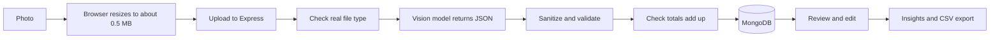

# ReceiptLens

Snap a photo of a receipt and ReceiptLens reads the store, date, items, tax and total. It then checks
that the numbers add up, so you only fix what is wrong. Built on the MERN stack with a vision model.

## Features

- Upload or photograph a receipt (on a phone, the camera opens directly)
- A vision model extracts structured data: store, date, currency, category, line items, subtotal,
  discount, tax, tip and total
- **Arithmetic check:** items, tax and tip are compared with the printed total. Mismatches are flagged
  so a misread digit does not slip into your records. Tax-inclusive prices (GST, VAT) and small
  rounding differences are handled
- Review screen with the photo next to the editable data, then save
- Search, filter by category or month, and export to CSV
- Insights: monthly spend, spend by category, a six-month trend, and top stores
- JWT authentication, per-user data isolation, rate limits, and image validation

## How it works



| Layer | Tech |
|---|---|
| Frontend | React 18, Vite, Tailwind CSS 4, Recharts |
| Backend | Node.js, Express |
| Database | MongoDB with Mongoose |
| AI | Gemini API (vision, structured JSON output) |
| Tooling | node:test, GitHub Actions CI |

## Run it locally

You need Node.js 18 or newer, MongoDB (local or a free Atlas cluster), and a free Gemini API key from
https://aistudio.google.com/apikey.

```bash
# Backend
cd server
cp .env.example .env      # Windows: copy .env.example .env
# fill in MONGO_URI, JWT_SECRET and GEMINI_API_KEY
npm install
npm run dev               # http://localhost:5000

# Frontend, in a second terminal
cd client
npm install
npm run dev               # http://localhost:5173
```

Run the tests with `cd server && npm test`. They run offline: the AI call is replaced with a stub.

## Project structure

```
server/src
  routes/receipts.js    upload, list, edit, delete, image, CSV export
  routes/stats.js       monthly totals, categories, trend, top stores
  services/gemini.js    the only file that talks to the AI provider
  services/extract.js   the prompt, response schema, and extraction call
  utils/receiptData.js  sanitizing and the arithmetic check (the core logic)
  utils/sniff.js        checks real image bytes, not just the file extension
  utils/csv.js          CSV with spreadsheet-formula protection
client/src
  components/           ReceiptEditor, ScanTab, ReceiptsTab, InsightsTab
  lib/image.js          resize and re-encode photos before upload
  lib/totals.js         the same arithmetic check, run live while editing
```

## Design decisions worth explaining in an interview

- **Never trust model output.** The model's JSON goes through `sanitizeReceipt`: numbers are parsed
  from messy strings, unknown categories become "Other", impossible or future dates are dropped, items
  are capped, and text is trimmed. The model can be wrong, so the app treats it as untrusted input.
- **Structured output.** The request includes a response schema, so the model returns JSON in a fixed
  shape instead of free text.
- **Verification, not blind trust.** The arithmetic check turns a misread digit into a visible warning.
  A person confirms every receipt before it counts as reviewed.
- **Line prices are line totals.** The prompt defines "price" as the amount printed on the line, which
  avoids confusion between unit price and line total.
- **Day-first dates.** Ambiguous dates like 03/10/26 are read as day/month/year. Change the prompt in
  `services/extract.js` if your receipts use month/day.
- **Resize in the browser.** Phone photos are 4 to 12 MB. Shrinking them first makes uploads fast and
  stays under the 5 MB limit, and the canvas step also fixes rotation.
- **File sniffing.** The server checks the file's first bytes, because the browser-reported type can be
  wrong or forged.
- **CSV injection protection.** A store name like `=HYPERLINK(...)` would run as a formula in Excel, so
  cells starting with `= + - @` are prefixed with an apostrophe.
- **Currencies stay separate.** Totals are never added across currencies. The dashboard shows one at a time.

## Limits to know about

- Money is stored as decimal numbers rounded to two places. A production finance app would store
  integer cents.
- Photos are stored in MongoDB, which is fine at this scale. For many users, move them to object storage
  such as S3 and keep only the key in the database.
- One receipt per photo. Very long receipts photographed in pieces are not stitched together.
- Handwritten receipts and blurry or low-light photos read less reliably.

## Ideas to extend it

1. **Accuracy test:** photograph 20 real receipts, correct them by hand, and measure how often store,
   date and total are right. That gives you real numbers for your resume.
2. Monthly budgets per category, with an alert when you are close.
3. Recurring expense detection.
4. Move photos to S3 or Cloudinary.
5. Multi-photo receipts.

## Troubleshooting

- **"model not found" or 404 from the AI API:** model names change. Update `GEMINI_MODEL` in
  `server/.env` using the current name in the Gemini API docs.
- **"That doesn't look like a receipt":** retake the photo flat, in even light, with the whole receipt in view.
- **429 or quota errors:** you hit the free tier limit. Wait a minute and retry.
- **iPhone photos fail:** browsers cannot read HEIC. Set the camera to "Most Compatible" or convert to JPG.

## Deploying

Backend on Render: root directory `server`, build command `npm install`, start command `npm start`. Add
your `.env` values and set `CLIENT_URL` to your frontend URL. Database on MongoDB Atlas. Frontend on
Vercel with root directory `client`, plus a `vercel.json` that forwards API calls to the backend:

```json
{
  "rewrites": [{ "source": "/api/:path*", "destination": "https://YOUR-APP.onrender.com/api/:path*" }]
}
```

